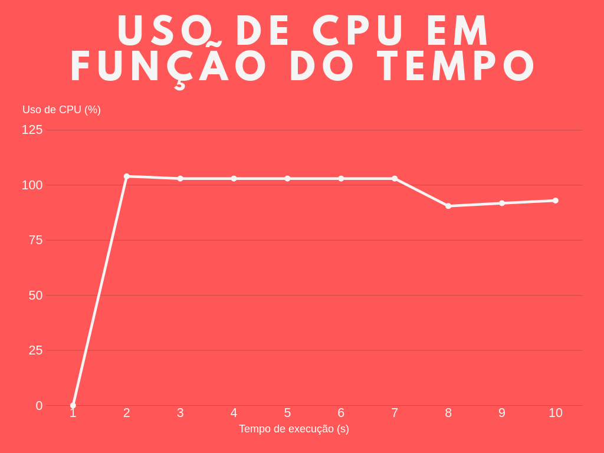
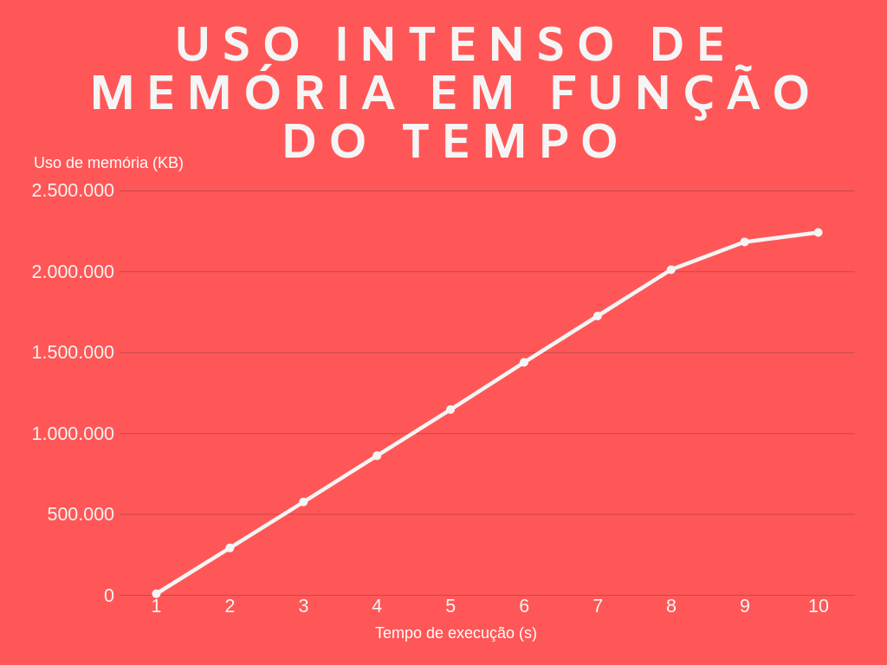

# Identificação

* Página do repositório do trabalho ([link GitHub](https://github.com/jorglucas/teaching/tree/master/2019.1-IAC/AB2.1-TP))

* Discente 1
	* Nome: Carllos Eduardo Ferreira Lopes
	* Matrícula: 19111150
	* Distribuição da nota (34%): 
* Discente 2
	* Nome: Jorge Lucas Alves de Almeida
	* Matrícula: 19111159
	* Distribuição da nota (33%): 
* Discente 3
	* Nome: Rick Martim Lino dos Santos
	* Matrícula: 19111330
	* Distribuição da nota (33%): 		
	
	
# Discussão 
-
	Para que um programa seja executado ele precisa ser convertidos em processos, assim é necessário designar o descritor
	de processos, alocar espaço na memória para o código (área conhecida como TEXT, onde se encontra o programa 
	principal, as funções e as bibliotecas), os dados (data, área onde as variáveis são alocadas - sejam globais, locais 
	estáticas, buffers internos) e a pilha (que possui o HEAP, área onde se localiza as variáveis dinâmicas, e o STACK, 
	endereços de retorno de chamadas e parâmetros de funções).

## Utilização intensa da UCP

-	Quando o programa é executado com o parametro "uso_cpu", na função main é processada a condição de funcionamento e
	repetição durante 10 segundos de monitoramento, após isso o processo "filho" é morto. Por conseguinte, o resultado
	obtido foi o desejado, tendo em vista que foi gerado uma utilização intensa da CPU com uma variação de 0% a 104% de
	uso da CPU enquanto o programa estava sendo executado.
	
	A primeira etapa do programa é a criação de um processo, chamado de processo "filho", por meio da função fork(). 
	Esta função tem um retorno, se este retorno for um valor menor que 0 (zero), significa que houve um erro na criação
	do processo, retorna um valor maior que 0 (zero) caso seja o processo original, chamado de processo "pai" e retorn um
	valor igual a 0 (zero), caso seja o processo "filho", tal retorno é o distinguidor do processo (pid). Após isso serão
	feitas comparações, caso o pid seja menor que 0 é mostrada a mensagem "Falha ao criar o processo!" e o programa é 
	encerrado, se o pid for maior que 0 o processo filho foi executado e retornou o id do seu processo para o pai, então
	o id do filho é salvo e convertido para uma string. Se o argumento for "uso_cpu", é executado o código de uso intenso
	da CPU, se o argumento for "cpu_e_memoria", é executado o codigo de uso intenso de CPU e Memória.
	
	Após identificado o argumento, o programa direciona a uma estrutura de repetição (for), com um loop finito, com uma
	condição de funcionamento de 10 segundos, o for vai "digitar" no terminal o comando salvo na string bash_cmd 10(dez)
	vezes. 
	A função system(bash_cmd) é a responsável por inserir a string no bash do Linux de 1 em 1 segundo, sendo controlada 
	pela função sleep. Diante disso, é fundamental que o processo filho seja "morto" e é a função system que fará isso
	através do comando(na forma de string) "Kill " seguido pelo pid do "filho". 
	
	

## Utilização intensa da UCP e memória

-	Quando o programa é executado com o argumento "cpu_e_memoria", na função "main" é processada uma condição que simula
	o uso intenso da cpu através de um loop finito, porém muito longo. Esse loop é feito utiizando o for() com um
	parâmetro "k" que executa a função malloc muitas vezes, fazendo com que seja alocada muita memória para aquele
	processo em execução, o processo filho. A função malloc utilizada, aloca 2 bytes na memória RAM cada vez que é
	executada, sendo assim, em um loop muito longo, aloca uma sequencia muito grande de bytes o que aumenta muito o 
	consumo de memória RAM.
	
	
# Resultados
- Abaixo estão descritos os resultados obtidos quanto ao uso de pcu e memória do processo filho criado.

	  

	No gráfico acima, é interessante observar que em um curto periodo de tempo (entre o segundo 0 e o segundo 1) o uso da CPU tem um grande crescimento de 0% até o pico de 104% e se matém assim até o segundo 7, onde tem uma leve diminuição. *No eixo horizontal está representado os segundos de execução e no eixo vertical o consumo de CPU.*

	  

	Neste segundo gráfico observamos que a curva de crescimento da quantidade de memória alocada é diretamente proporcional ao aumento dos segundos e que cresce muito devido a função malloc que aloca muita memoria para esse processo. *No eixo horizontal está representado os segundos de execução e no eixo vertical a quantidade de memória alocada para o processo.*
	
	 
	
	Neste último gráfico vemos como se comporta o consumo de CPU em relação a quantidade de memória alacoda pela função malloc. *No eixo horizontal está representado o uso de CPU e no eixo vertical a quantidade de memória alocada para o processo.*
	
